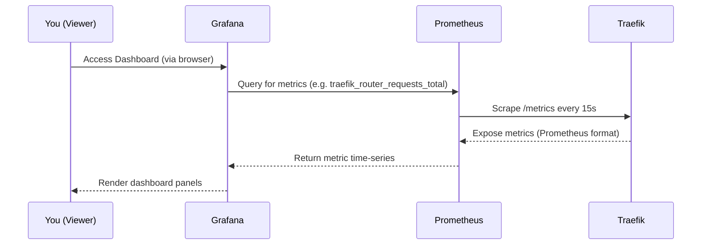

# Setting Up Grafana with Prometheus & Traefik (With SSO via Authentik)

This document captures the step-by-step process of integrating Grafana with Prometheus and Traefik, along with SSO via Authentik. It includes configuration files, lessons learned, and key troubleshooting insights.

---

## Overview

- **Reverse Proxy**: Traefik v2.10 (Dockerized)
- **Monitoring**: Prometheus
- **Visualization**: Grafana
- **SSO**: Authentik using OIDC
- **Container Network**: `shared_network`

---

## File Structure

```bash
project-root/
├── traefik/
│   ├── docker-compose.yml
│   └── config/
│       ├── traefik.yml
│       └── dynamic/headers.yml
├── monitoring/
│   ├── docker-compose.yml
│   └── prometheus/
│       └── prometheus.yml
```

---

## Traefik Docker Compose

```yaml
services:
  traefik:
    container_name: traefik
    image: traefik:v2.10
    command:
      - "--configFile=/etc/traefik/conf/traefik.yml"
    labels:
      - "traefik.enable=true"
      - "traefik.http.routers.traefik.rule=Host(`traefik.exeltan.com`)"
      - "traefik.http.routers.traefik.service=api@internal"
      - "traefik.http.routers.traefik.entrypoints=websecure"
      - "traefik.http.routers.traefik.tls=true"
      - "traefik.http.routers.traefik.tls.certresolver=myresolver"
      - "traefik.http.routers.traefik.middlewares=authentik@file"
    ports:
      - "80:80"
      - "443:443"
      - "8080:8080" # expose for metrics as well
    volumes:
      - "/var/run/docker.sock:/var/run/docker.sock:ro"
      - "./letsencrypt:/letsencrypt"
      - "./config:/etc/traefik/conf"
    networks:
      - shared_network

networks:
  shared_network:
    external: true
```

---

## Traefik Config (traefik.yml)

```yaml
entryPoints:
  web:
    address: ":80"
  websecure:
    address: ":443"

providers:
  docker:
    exposedByDefault: false
  file:
    directory: "/etc/traefik/conf/dynamic"
    watch: true

api:
  dashboard: true

certificatesResolvers:
  myresolver:
    acme:
      email: exelbert2010@gmail.com
      storage: /letsencrypt/acme.json
      tlsChallenge: true

metrics:
  prometheus:
    addEntryPointsLabels: true
    addRoutersLabels: true
    addServicesLabels: true
```

---

## Authentik Middleware (headers.yml)

```yaml
http:
  middlewares:
    authentik:
      forwardAuth:
        address: http://authentik:9000/outpost.goauthentik.io/auth/traefik
        trustForwardHeader: true
        authResponseHeaders:
          - X-authentik-username
          - X-authentik-groups
          - X-authentik-email
```

---

##  Monitoring Docker Compose (Grafana + Prometheus)

```yaml
services:
  prometheus:
    image: prom/prometheus:latest
    container_name: prometheus
    volumes:
      - ./prometheus/prometheus.yml:/etc/prometheus/prometheus.yml
      - prometheus-data:/prometheus # <-- This is crucial
    ports:
      - "9090:9090"
    networks:
      - shared_network
  grafana:
    image: grafana/grafana:latest
    container_name: grafana
    ports:
      - "3000:3000"
    environment:
      - GF_AUTH_DISABLE_LOGIN_FORM=true # Enable admin Mode
      - GF_AUTH_ANONYMOUS_ENABLED=false # Enable admin Mode
      - GF_SERVER_ROOT_URL=https://grafana.exeltan.com
      - GF_AUTH_GENERIC_OAUTH_ENABLED=true
      - GF_AUTH_GENERIC_OAUTH_NAME=Authentik
      - GF_AUTH_GENERIC_OAUTH_ALLOW_SIGN_UP=true
      - GF_AUTH_GENERIC_OAUTH_CLIENT_ID=${AUTH_CLIENT_ID}
      - GF_AUTH_GENERIC_OAUTH_CLIENT_SECRET=${AUTH_CLIENT_SECRET}
      - GF_AUTH_GENERIC_OAUTH_SCOPES=openid profile email
      - GF_AUTH_GENERIC_OAUTH_AUTH_URL=https://authentik.exeltan.com/application/o/authorize/
      - GF_AUTH_GENERIC_OAUTH_TOKEN_URL=https://authentik.exeltan.com/application/o/token/
      - GF_AUTH_GENERIC_OAUTH_API_URL=https://authentik.exeltan.com/api/v3/user/me/
      - GF_AUTH_SIGNOUT_REDIRECT_URL=https://authentik.exeltan.com/application/o/logout/
      # Optionally map user groups to Grafana roles
      - GF_AUTH_GENERIC_OAUTH_ROLE_ATTRIBUTE_PATH=contains(groups, 'authentik Admins') && 'Admin' || 'Viewer'
    volumes:
      - grafana-storage:/var/lib/grafana
        #- ./dashboards:/etc/grafana/dashboards

    labels:
      - "traefik.enable=true"
      - "traefik.http.routers.grafana.rule=Host(`grafana.exeltan.com`)"
      - "traefik.http.routers.grafana.entrypoints=websecure"
      - "traefik.http.routers.grafana.tls=true"
      - "traefik.http.routers.grafana.tls.certresolver=myresolver"
    env_file:
      - .env
    networks:
      - shared_network

volumes:
  grafana-storage:
  prometheus-data:

networks:
  shared_network:
    external: true
```

---

##  Prometheus Config (prometheus.yml)

```yaml
global:
  scrape_interval: 15s

scrape_configs:
  - job_name: "prometheus"
    static_configs:
      - targets: ["localhost:9090"]

  - job_name: "traefik"
    static_configs:
      - targets: ["traefik:8080"]
```

---

## Issues & Fixes

### 1. Grafana Admin Role Not Working

**Problem**: OAuth user was stuck as Viewer.

**Fix**:

- Added group claim in Authentik: `groups: ["authentik Admins"]`
- Mapped it via:

```yaml
- GF_AUTH_GENERIC_OAUTH_ROLE_ATTRIBUTE_PATH=contains(groups, 'authentik Admins') && 'Admin' || 'Viewer'
- GF_AUTH_GENERIC_OAUTH_GROUPS_ATTRIBUTE_PATH=groups
```

### 2. `docker restart` didn't apply changes

**Problem**: Env var changes weren’t picked up

**Fix**:

```bash
docker compose down && docker compose up -d
```

### 3. Prometheus lost history after restart

**Problem**: No persistent volume attached to `/prometheus`

**Fix**:

```yaml
volumes:
  - prometheus-data:/prometheus
```

### 4. Traefik Metrics Endpoint Not Found (404)

**Problem**: Tried scraping `:8082` which doesn’t serve metrics

**Fix**:

- Removed `metrics:` entryPoint from `traefik.yml`
- Used default admin port `:8080` for `/metrics`
- Updated Prometheus scrape target to: `traefik:8080`

---

##  Result

- Traefik metrics flowing into Prometheus
- Grafana dashboard auto-provisioned
- Grafana behind SSO with Admin access
- Dashboards persist and reload automatically
- Prometheus correctly scrapes metrics on port 8080

Got it! Here's a clean and complete **README.md-style documentation** for your current monitoring setup — including **Traefik**, **Prometheus**, **Grafana**, and **Node Exporter** — with **dashboard ID 1860** (I believe you meant 1860, not 18960):

---

# Sequence Diagram of this setup:



-----

# Add node-exporter to check for VPS Server Performance

##  Services

### 1. Prometheus

- **Purpose**: Scrapes metrics from services (e.g., Traefik, Node Exporter)
- **Port**: `9090`

### 2. Node Exporter

- **Purpose**: Exposes host-level metrics like CPU, memory, disk usage
- **Port**: `9100`

### 3. Grafana

- **Purpose**: Dashboards and visualization for Prometheus metrics
- **Port**: `3000`
- **SSO**: Integrated with Authentik via OAuth2

---

## Folder Structure

```
monitoring/
├── docker-compose.yml
└── prometheus/
    └── prometheus.yml
```

---

## Configuration Details

### docker-compose.yml

Includes:

- `node-exporter` with `/proc`, `/sys`, and root filesystem mounted
- Connected via a shared Docker network (`shared_network`)

> `--path.*` arguments in `node-exporter` ensure it scrapes _host_ stats.

```
services:
  prometheus:
    image: prom/prometheus:latest
    container_name: prometheus
    volumes:
      - ./prometheus/prometheus.yml:/etc/prometheus/prometheus.yml
      - prometheus-data:/prometheus  # <-- This is crucial
    ports:
      - "9090:9090"
    networks:
      - shared_network

################ ADD THIS ################
  node-exporter:
    image: prom/node-exporter:latest
    container_name: node-exporter
    restart: unless-stopped
    ports:
      - "9100:9100"
    pid: "host"
    volumes:
      - /proc:/host/proc:ro
      - /sys:/host/sys:ro
      - /:/rootfs:ro
    command:
      - '--path.procfs=/host/proc'
      - '--path.sysfs=/host/sys'
      - '--path.rootfs=/rootfs'
    networks:
      - shared_network

################ EOL ADD THIS ################

  grafana:
    image: grafana/grafana:latest
    container_name: grafana
    ports:
      - "3000:3000"
    environment:
      - GF_AUTH_DISABLE_LOGIN_FORM=true   # Enable admin Mode
      - GF_AUTH_ANONYMOUS_ENABLED=false # Enable admin Mode
      - GF_SERVER_ROOT_URL=https://grafana.exeltan.com
      - GF_AUTH_GENERIC_OAUTH_ENABLED=true
      - GF_AUTH_GENERIC_OAUTH_NAME=Authentik
      - GF_AUTH_GENERIC_OAUTH_ALLOW_SIGN_UP=true
      - GF_AUTH_GENERIC_OAUTH_CLIENT_ID=${AUTH_CLIENT_ID}
      - GF_AUTH_GENERIC_OAUTH_CLIENT_SECRET=${AUTH_CLIENT_SECRET}
      - GF_AUTH_GENERIC_OAUTH_SCOPES=openid profile email
      - GF_AUTH_GENERIC_OAUTH_AUTH_URL=https://authentik.exeltan.com/application/o/authorize/
      - GF_AUTH_GENERIC_OAUTH_TOKEN_URL=https://authentik.exeltan.com/application/o/token/
      - GF_AUTH_GENERIC_OAUTH_API_URL=https://authentik.exeltan.com/api/v3/user/me/
      - GF_AUTH_SIGNOUT_REDIRECT_URL=https://authentik.exeltan.com/application/o/logout/
      # Optionally map user groups to Grafana roles
      - GF_AUTH_GENERIC_OAUTH_ROLE_ATTRIBUTE_PATH=contains(groups, 'authentik Admins') && 'Admin' || 'Viewer'
    volumes:
      - grafana-storage:/var/lib/grafana
        #- ./dashboards:/etc/grafana/dashboards

    labels:
      - "traefik.enable=true"
      - "traefik.http.routers.grafana.rule=Host(`grafana.exeltan.com`)"
      - "traefik.http.routers.grafana.entrypoints=websecure"
      - "traefik.http.routers.grafana.tls=true"
      - "traefik.http.routers.grafana.tls.certresolver=myresolver"
    env_file:
      - .env
    networks:
      - shared_network

volumes:
  grafana-storage:
  prometheus-data:


networks:
  shared_network:
    external: true


```

### prometheus/prometheus.yml

```yaml
global:
  scrape_interval: 15s

scrape_configs:
  - job_name: "traefik"
    static_configs:
      - targets: ["traefik:8080"]

  ## Just add this
  - job_name: "node-exporter"
    static_configs:
      - targets: ["node-exporter:9100"]
```

> `node-exporter:9100` works because Prometheus and Node Exporter share the same Docker network.

---

## 📊 Grafana Setup

Import Node Exporter Dashboard:

- Go to **+ → Import**
- Use Dashboard ID: **1860** (Node Exporter Full)
- Select Prometheus as the data source

---

## Verification

- **Prometheus UI** → http://<your-vps>:9090 (<b>If you open up this port for traefik only</b>)

  - Query: `node_memory_MemAvailable_bytes` → if working

- **Grafana** → View system metrics via Dashboard 1860:
  - CPU usage
  - RAM, disk
  - Network stats
  - Uptime

---
 

Made with frustration, errors, restarts, but finally: **success** 💪
